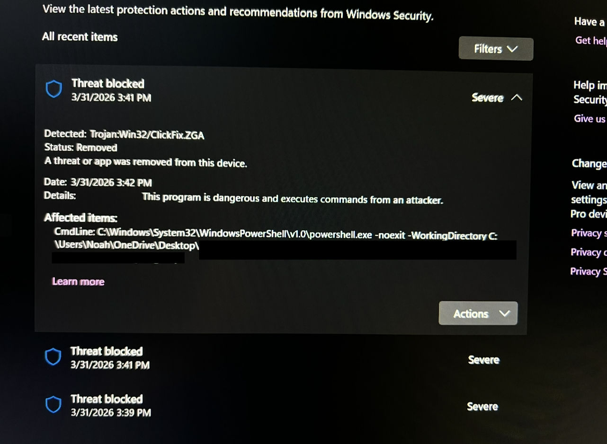

# ClickFix Malware Incident Response

**Personal hardware DFIR investigation · March 31, 2026**

A walkthrough of how I investigated and verified a ClickFix social engineering attack on my personal workstation. Microsoft Defender caught the payload before execution; I treated the alert as a full incident anyway, ran the complete IR workflow, and confirmed the system was clean. Includes the investigation steps, tools used at each stage, findings, and lessons learned.

---

## TL;DR

Microsoft Defender flagged three execution attempts (signature `ClickFixZGA`) between 3:39 and 3:41 PM on March 31, 2026, triggered by a malicious PowerShell command staged through a ClickFix lure delivered via a zip file disguised as photos. All three attempts were blocked with status Removed before any code executed. Rather than stopping at "the AV caught it," I ran a full multi-tool verification: Process Explorer with VirusTotal, Autoruns and Task Scheduler audit, PowerShell script-block log review, %temp% inspection, and a Malwarebytes second-opinion scan. Outcome: no persistence, no second-stage execution, no outbound connections. System confirmed clean end to end.

---

## What is ClickFix

ClickFix is a social engineering technique that gets the victim to execute a malicious command themselves, sidestepping browser and email protections that would normally catch a direct delivery. The classic variant uses a fake CAPTCHA or browser update page that instructs the user to press `Win+R`, paste a "verification" command, and hit Enter. The clipboard has already been silently populated with a malicious PowerShell or `mshta` one-liner by JavaScript on the page.

The variant I encountered used a different lure surface: a zip file presented as a photo archive, with social engineering directing the user to right-click in the folder and "Open PowerShell here." The malicious files were staged to execute via PowerShell's working directory context, with the actual payload pulled in through a follow-on command. Defender intercepted the PowerShell launch pattern at the system level before any payload ran.

It works because the user thinks they are following normal instructions rather than running an attacker's code; the technique abuses trust in the OS, not a vulnerability in it.

---

## Initial Detection

**Trigger:** Microsoft Defender alert `Behavior:Win32/ClickFixZGA` fired three times between 3:39 PM and 3:41 PM on March 31, 2026.

**Defender Protection History captured:**
- Three blocked execution attempts within a two-minute window
- Command line on each: `powershell.exe -noexit -WorkingDirectory C:\Users\Noah\OneDrive\Desktop\`
- Status: Removed on all three

**Immediate actions:**
1. Stopped interacting with the suspect files; did not close PowerShell windows or click through any prompts
2. Opened a triage notebook to timestamp every action from this point forward
3. Decided to treat this as a full incident even though Defender had reported "Removed" status, because three repeated attempts indicated active staging, not a single accidental trigger

<!--  -->

---

## Investigation Workflow

### Stage 1: Full Defender scan

Started with the most obvious check: a full Defender scan to confirm there was nothing else lurking that the initial behavioral block had missed.

**Result:** Clean. No additional detections, no quarantined items beyond the three blocked attempts already in Protection History.

### Stage 2: Filesystem inspection of staging locations

Checked the locations where ClickFix payloads typically drop intermediate files:

- `%temp%` audited for `.ps1`, `.vbs`, `.cmd`, and `.bat` files created in the relevant time window
- The originating folder on Desktop reviewed for hidden or recently-modified files
- `shell:startup` checked for any new entries

**Result:** No malicious scripts found in `%temp%`. Startup folder clean. Originating zip and its extracted contents were the only artifacts present, and those got isolated for review.

### Stage 3: Process telemetry

**Tool:** Process Explorer (Sysinternals) with VirusTotal integration enabled.

Walked the full process tree with the VT column visible. Process Explorer's VT integration submits process hashes to VirusTotal and displays detection counts inline; means I can review every running process for known-bad hashes without alt-tabbing.

**What I looked for:**
- Orphaned PowerShell or `mshta` instances
- Processes running from `%TEMP%`, `%APPDATA%`, or `%LOCALAPPDATA%`
- Unsigned binaries in user-writable paths
- VT detections greater than zero on any process

**Result:** Every running process showed 0/72 or near-zero VT detections; all paths resolved to expected locations (Program Files, System32, legitimate user-installed applications); all signatures valid. No suspicious child processes spawned from explorer.exe or browser processes.

<!--  -->

### Stage 4: Persistence audit

**Tools:** Autoruns (Sysinternals) and Task Scheduler.

Ran Autoruns with "Verify Code Signatures" and "Hide Microsoft and Windows Entries" enabled to cut noise. Walked through the relevant tabs: Logon, Scheduled Tasks, Services, WMI, and Image Hijacks.

Cross-checked Task Scheduler directly in the GUI to verify Autoruns wasn't suppressing anything.

**Result:** All scheduled tasks resolved to legitimate sources: Adobe, Brave, Zoom, NVIDIA, OneDrive. No new tasks created in the incident window. No suspicious Run keys, no rogue services, no WMI event subscriptions. The system showed no signs of persistence having been established.

<!--  -->

### Stage 5: PowerShell script-block logs

**Tool:** Event Viewer, navigated to `Applications and Services Logs > Microsoft > Windows > PowerShell > Operational`, filtered on Event ID 4104.

This is the critical step for ClickFix investigations: Event ID 4104 captures the deobfuscated script block content, even when the original command was Base64-encoded or compressed. If anything had executed, this is where the evidence would surface.

**Result:** The only Event ID 4104 entries in the relevant window were legitimate calls to a secure password generator function using `RNGCryptoServiceProvider`, consistent with my password manager's normal operation. No suspicious script blocks, no encoded payloads, no network-bound commands.

The absence of any malicious 4104 events was the cleanest possible confirmation that the payload never made it past Defender's block.

<!--  -->

### Stage 6: Independent second-opinion scan

Ran Malwarebytes Free as a cross-engine verification check, since relying on a single AV's "all clear" after a real attempt is a known blind spot.

**Pre-install verification:** Verified the Malwarebytes installer hash before running it.
- SHA-256: `AFC772D7ECAC253595759055B552B14B86A1E11A8541CFEFA11D4060B9470824`
- VirusTotal: 0/72 detections
- Digital signature: issued to Malwarebytes Inc., valid

**Result:** Clean full scan. Uninstalled Malwarebytes after the scan completed since I wanted to keep Defender as the only resident endpoint protection.

### Stage 7: Network activity verification

This step gets to the heart of "did anything phone home?"

I run a first-time outbound connection alerter app that flags any process making its first outbound network call. I also have a traffic widget that surfaces incoming and outgoing network traffic, plus CPU and RAM utilization, in real time.

**Result:** No first-time outbound connection alerts fired during the incident window. Traffic widget showed no anomalous spikes. This was the second-most reassuring data point of the entire investigation, behind the clean 4104 logs.

---

## Findings Summary

The payload was blocked at the behavioral detection layer before any code executed. No persistence was established. No outbound connections were attempted by any malicious process. No artifacts were left behind beyond the original lure files, which were isolated and removed.

What I documented:
- Time of detection: 3:39 to 3:41 PM, March 31, 2026
- Detection signature: `Behavior:Win32/ClickFixZGA`
- Attempts blocked: 3
- Persistence established: None
- Outbound connections: None
- Verification methods used: 7

---

## Indicators of Compromise

| Type | Value | Notes |
|------|-------|-------|
| Signature | `Behavior:Win32/ClickFixZGA` | Defender behavioral detection |
| Command | `powershell.exe -noexit -WorkingDirectory C:\Users\Noah\OneDrive\Desktop\` | The command line Defender caught and blocked |
| Vector | Zip file disguised as photos with social engineering to open PowerShell in folder | Non-standard ClickFix lure surface |
| Time | 2026-03-31 15:39 to 15:41 local | Three blocked attempts in window |

---

## What I'd Do Differently

A few items I took out of the investigation that improved my posture going forward:

**Enable PowerShell script-block logging system-wide, not just the default Operational log.** Full script-block logging captures every block, not only those Windows flags as suspicious. I've since enabled it via registry so future investigations have complete coverage instead of relying on the default subset.

**The "trust but verify Defender" instinct paid off.** Defender's Protection History said Removed; that's the right place to start, not stop. Walking the full IR workflow on a "blocked" alert is what would have caught a second-stage payload if one had quietly succeeded after the initial block, and it produces a defensible record either way.

**Independent detection layers are worth their cost.** The first-time outbound connection alerter gave me a second signal entirely independent of Defender and AV scanners. If something had phoned home, that app would have flagged it even if every signature-based tool missed. Layered detection where the layers actually use different methodologies is how you avoid blind spots.

**Document during the investigation, not after.** Timestamped notes during the response made the writeup possible; trying to reconstruct from memory days later would have lost the cleanest details. This is the habit I'd carry into a SOC role without modification.

---

## Tools Referenced

| Tool | Purpose |
|------|---------|
| Microsoft Defender | Initial detection, Protection History review, full scan verification |
| Process Explorer (Sysinternals) | Process tree analysis with VirusTotal integration |
| Autoruns (Sysinternals) | Persistence mechanism audit |
| Task Scheduler | Direct scheduled task review |
| Event Viewer | PowerShell Event ID 4104 script-block log analysis |
| Malwarebytes Free | Independent second-opinion full scan |
| VirusTotal | Hash verification on installer and process binaries |
| First-time outbound connection alerter | Independent network anomaly signal |

---

## References

- [Microsoft Defender PowerShell logging documentation](https://learn.microsoft.com/en-us/powershell/module/microsoft.powershell.core/about/about_logging_windows)
- [Sysinternals Suite](https://learn.microsoft.com/en-us/sysinternals/)
- [Microsoft Threat Intelligence on ClickFix](https://www.microsoft.com/en-us/security/blog/)

---

*Personal incident response writeup. Investigation conducted on personally owned hardware, March 31, 2026. Documentation written contemporaneously and refined for portfolio use.*

